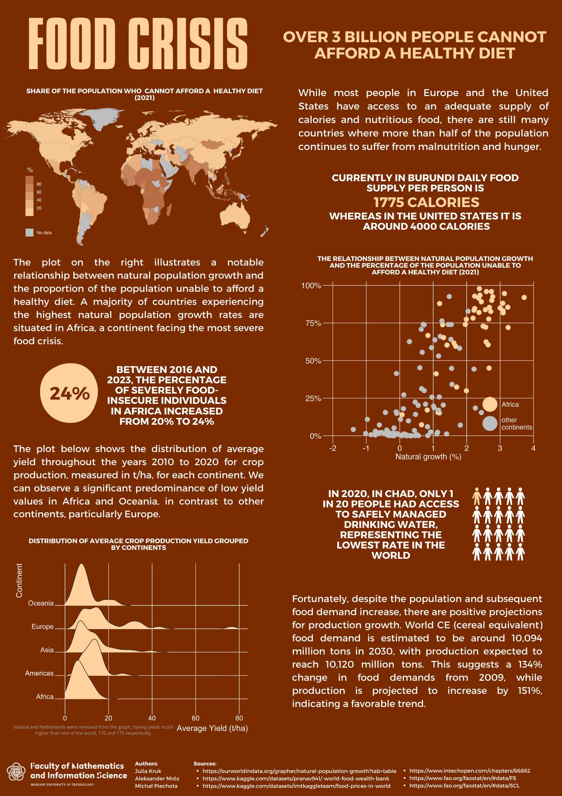

# Food crisis - a poster
*Authors: [Julia Kruk](https://github.com/krukj), [Michał Piechota](https://github.com/Frejzy) & [Aleksander Mróz](https://github.com/Zyziek055)*
## About the project
The poster highlights the global disparity in access to food, emphasizing the prevalence of malnutrition and hunger in certain regions, particularly Africa. It draws attention to the correlation between natural population growth and the inability to afford a healthy diet, with a focus on the severe food crisis in Africa. Despite the challenges, the poster ends on a positive note by presenting projections for a favorable trend in food production growth, indicating a potential improvement in addressing future food demands.

## Used technologies 
- programming language: **R**
- libraries used:
  - data analysis: **dplyr**, **tidyr**
  - data visualisation: **ggplot**, **cowplot**
## Poster

*The project was made for the Data Visualization Techniques course during the 3rd semester of the Data Science program at the Faculty of Mathematics and Information Systems, Warsaw University of Technology. Course coordinator: [Anna Kozak](https://github.com/kozaka93).*
